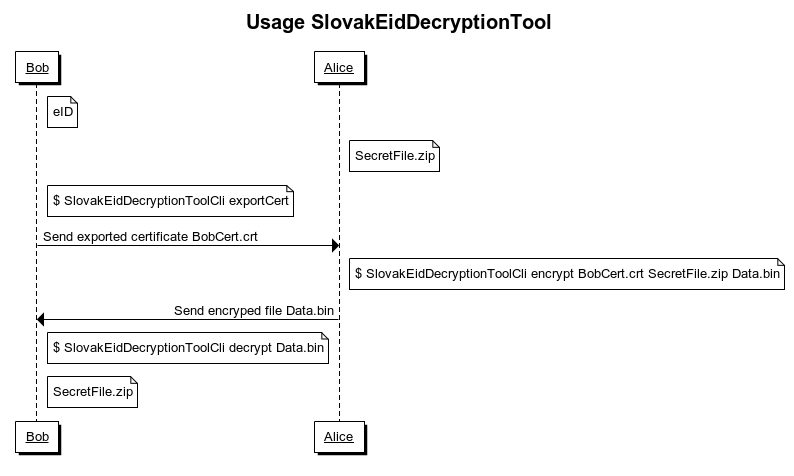

# Slovak eID Decryption tool
_Slovak eID Decryption tool_ is util for  encryption certificate extraction, from Slovak eID card,
encrypt any file using encryption certificate and decrpt encrypted file using Slovak eID card.

This program use _AES-256 CBC_ for file encryption and RSA 3072 with *RSA PKCS1 padding* for wrapping AES key (RSA 3072 and PKCS1 padding support Slovak eID).

This project aim to education [PKCS#11](https://www.cryptsoft.com/pkcs11doc/STANDARD/pkcs-11v2-20.pdf) standard and using using Slovak eID.

Used:
* .Net Core 2.1 - multi-platform,
* [PKCS#11 Interop](https://pkcs11interop.net/) for communication with eID "driver" (or other hardware token),
* [commandline](https://github.com/commandlineparser/commandline) for parsing command line arguments.

## Prerequisites
 * .Net Core SDK for build,
 * Slovak eID card with ZEP certificate,
 * Driver for smart card reader (from [Slovensko.sk](https://www.slovensko.sk/sk/na-stiahnutie)),
 * Application _eID klient_ (from [Slovensko.sk](https://www.slovensko.sk/sk/na-stiahnutie)).

## Usage
Bob has Slovak eID card, Alice wants to send SeecritFile.zip to Bob.

## Container structure
|Offset (bytes)|Size (bytes)|Description|
|-|-|-|
|0|8|ASCII string "SkEidDT_"|
|8|2|Container version (_1_)|
|10|4|Reserved (must contain zeroes)|
|14|4|Key type (_RSA2048_, _RSA3072_, _RSA4096_)|
|20|8|Size of encrypted data|
|28|40|Encrypted certificate thumbprint as ASCII string|
|68|[by Key type]|Encrypted AES-256 key.|
|?|16|IV for AES-256|
|?|?|Encrypted section data|

### Encrypted section data structure

|Offset (bytes)|Size (bytes)|Description|
|-|-|-|
|0|16|Random seed|
|16|4|Size of additional padding size|
|20|4|Size of file name|
|24|?|Random data section|
|?|?|Name of file as UTF-8 string|
|?|?|Data|

## Disclaimer
This project is technology demo. For real secrets use trusted programs e.g. [VeraCrypt](https://www.veracrypt.fr/en/Home.html).

## Read more
1. <https://hohnstaedt.de/xca/>
1. [Slovensko.sk](https://www.slovensko.sk/sk/na-stiahnutie)